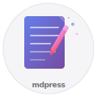
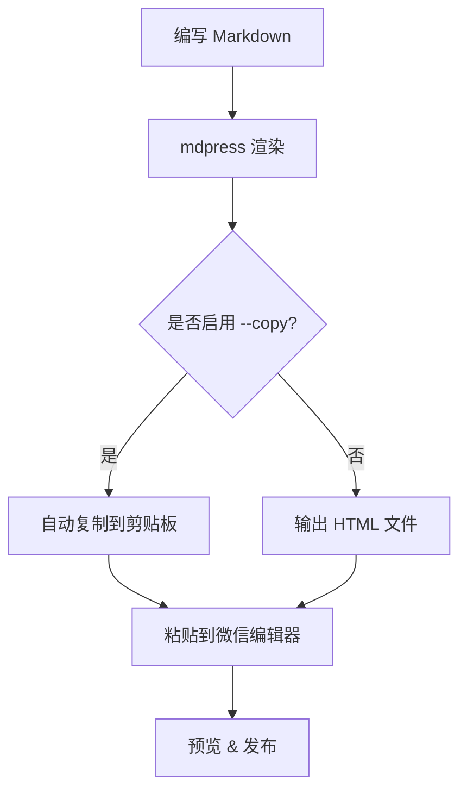
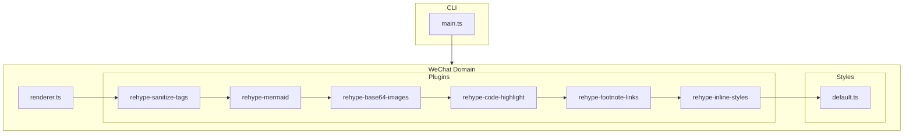

# 用 Markdown 写微信公众号文章

用 mdpress 将 Markdown 渲染为微信公众号编辑器兼容的富文本 HTML，支持图片、代码高亮、Mermaid 流程图、表格等全部特性。

---

## 为什么选择 Markdown

Markdown 是技术写作的事实标准。相比在微信编辑器中手动排版，用 Markdown 写作有三个明显优势：

1. **专注内容**：不需要关心字号、颜色、间距
2. **版本管理**：纯文本格式，天然支持 Git
3. **一次编写，多处发布**：同一份 `.md` 可以生成博客、公众号、PDF

> 好的工具让你专注于创造，而不是排版。

---

## 快速上手

### 安装

```bash
npm install -g mdpress
```

### 使用

```bash
mdpress -i article.md -o output.html --copy
```

加上 `--copy` 参数会自动将渲染结果复制到剪贴板，直接粘贴到微信编辑器即可。

---

## 代码高亮

mdpress 使用 highlight.js 进行语法高亮，支持 180+ 种语言。以下是几种常见语言的效果：

### TypeScript

```typescript
interface Article {
  title: string;
  tags: string[];
  publishedAt: Date;
}

async function publish(article: Article): Promise<void> {
  const html = await render(article);
  console.log(`Published: ${article.title}`);
}
```

### Python

```python
from dataclasses import dataclass
from datetime import datetime

@dataclass
class Article:
    title: str
    tags: list[str]
    published_at: datetime

def publish(article: Article) -> None:
    html = render(article)
    print(f"Published: {article.title}")
```

### JSON 配置

```json
{
  "name": "mdpress",
  "version": "0.1.0",
  "plugins": ["base64-images", "code-highlight", "mermaid"]
}
```

---

## 图片支持

本地图片会自动转为 base64 内联，无需上传图床。支持 PNG、JPEG、GIF、SVG、WebP 格式，超过 2MB 自动压缩。

### PNG 图片


### GIF 图片


### SVG 图标



### 大图压缩

下面这张 3000×3000 的图片会被自动压缩到 2MB 以内：


---

## 表格

### 功能清单

| 功能 | 状态 | 说明 |
|------|------|------|
| 图片 Base64 转换 | 已完成 | 本地图片自动内联 |
| 代码语法高亮 | 已完成 | 180+ 种语言 |
| Mermaid 流程图 | 已完成 | 渲染为 PNG |
| 内联样式注入 | 已完成 | 微信编辑器兼容 |
| HTML 标签清理 | 已完成 | 防止 XSS |
| 脚注链接转换 | 已完成 | 适配微信编辑器 |
| 表格内联样式 | 已完成 | 标准 table + 内联 CSS |

### API 参数

| 参数 | 类型 | 默认值 | 说明 |
|------|------|--------|------|
| `input` | string | — | 输入 Markdown 文件路径 |
| `output` | string | — | 输出 HTML 文件路径 |
| `copy` | boolean | false | 是否复制到剪贴板 |

### 插件管线

| 顺序 | 插件 | 职责 |
|------|------|------|
| 1 | rehype-sanitize-tags | 清理危险标签，div 转 section |
| 2 | rehype-mermaid | Mermaid 代码块渲染为 PNG |
| 3 | rehype-base64-images | 本地图片转 base64 data URI |
| 4 | rehype-code-highlight | 代码块语法高亮 |
| 5 | rehype-footnote-links | 脚注锚点转内联文本 |
| 6 | rehype-inline-styles | 注入内联样式，移除 class |

---

## Mermaid 流程图

### 渲染管线


### 发布流程



### 架构图



---

## 富文本排版

### 行内样式

这是一段包含各种行内样式的文本：**粗体强调**、*斜体*、`行内代码`、~~删除线~~，以及 <mark>高亮标记</mark>。

链接也有特殊样式：访问 [mdpress 项目](https://github.com) 了解更多。

### 引用

> 简洁是可靠的先决条件。
>
> — Edsger W. Dijkstra

### 任务列表

- [x] Markdown 解析
- [x] GFM 扩展支持
- [x] 代码语法高亮
- [x] 图片 Base64 转换
- [x] Mermaid 图表渲染
- [x] 表格内联样式
- [ ] 自定义主题支持
- [ ] 多平台输出

### 有序列表

1. 编写 Markdown 源文件
2. 运行 `mdpress -i input.md -o output.html`
3. 复制 HTML 到微信编辑器
4. 预览效果，调整细节
5. 发布文章

### 嵌套无序列表

- 渲染管线
  - remark（Markdown → MDAST）
  - rehype（MDAST → HAST → HTML）
- 插件体系
  - 图片处理
    - Base64 编码
    - 尺寸校验
    - 自动压缩
  - 样式注入
  - 标签清理

---

## 分割线

上面和下面各有一条水平分割线，用于分隔不同的内容区域。

---

## 脚注

mdpress 支持 GFM 脚注语法[^1]。脚注内容会在文章底部显示[^2]，并且链接会被转换为微信编辑器兼容的格式[^3]。

[^1]: GFM 即 GitHub Flavored Markdown，是 GitHub 对标准 Markdown 的扩展。
[^2]: 微信公众号编辑器不支持锚点跳转，因此脚注链接会被转换为纯文本上标。
[^3]: 具体实现见 `rehype-footnote-links` 插件。
